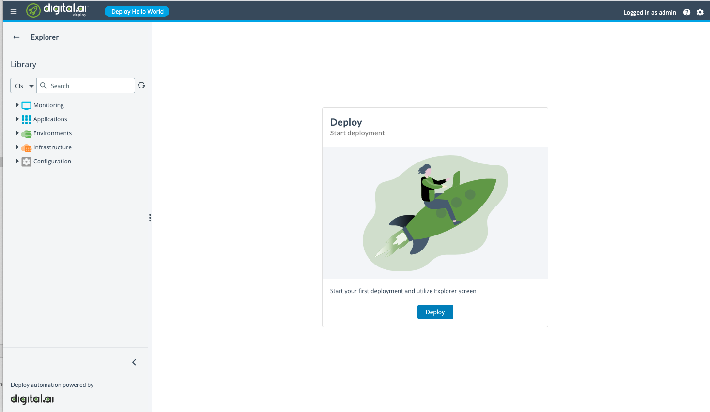
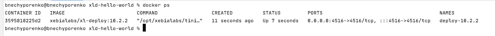
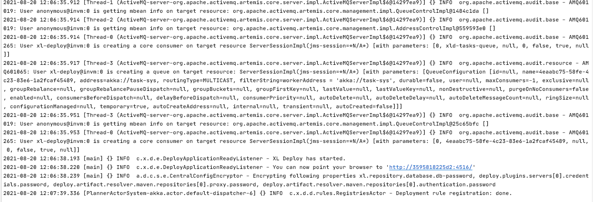

# xld-hello-world

This project shows how to use Integration Server Gradle Plugin to run Deploy for testing purposes.
The configuration is the easiest to get the grasp what is the minimum configuration required to make setup up and 
running and as a bonus to see "Deploy Hello World" on a top navigation bar :) 



The configuration how to run Gradle task, can be found in `.gradle/workflows/build.yaml`.

If you are going to configure it on a bare VM, you have to be sure you have the next things installed:

* Java 11
* Docker
* Docker Compose 

The main piece of integration server configuration is specified in this block in `build.gradle` file:

```groovy
integrationServer {
    servers {
        controlPlane {
            dockerImage = "xebialabs/xl-deploy"
            version = "10.2.2"
            httpPort = 4516
            yamlPatches = [
                    'centralConfiguration/deploy-server.yaml': [
                            'deploy.server.label': 'Deploy Hello World'
                    ]
            ]
        }
    }
}
```

| Name | Description | 
| :---: | :---: |
`servers` | section describes all servers that you can run. Currently only the first one will take an effect, and the rest will be ignored.
`controlPlane` | is the name of this server. This name won't be visible anywhere, you only have to specify it if you have  to read the configuration somewhere in gradle code. Like for example if you defined your own Gradle task below, and you want  to pass there the server http port, you can do it as: `integrationServer.server.controlPlane.httpPort`  
`dockerImage` | presence of this property makes the setup of Deploy be a container based, which will be pulled from the specified docker repository.
`version` | here you specify the version of Deploy you want to spin up. 
`httpPort` | is an optional field, if you don't specify it, the random port will be used. It's a good option when you run several tests in parallel on the same computer, and you don't want them to clash by using the same port.
`yamlPatches` | here you can apply overrides to a default files. Very handy in case you have to modify several fields only.

If you have to modify a lot of properties, it is better to use `overlays` and provide a complete file. More about it 
you can check in plugin docs: https://github.com/xebialabs/integration-server-gradle-plugin

The server label, which is displayed on a top navigation bar is possible to configure in `deploy-server.yaml` which
is a part of central configuration.

The official documentation:
https://docs.xebialabs.com/xl-deploy/10.2.x/javadoc/deploy-configuration-api/properties-api/index.html#deployserver-deploy-serveryaml

if you want to check logs of Deploy:

* run `docker ps` to find the container id 



In my example I stopped all other containers, and have only one running, in your case you can have a list, so you have 
to find the one which has the image name "xebialabs/xl-deploy:10.2.2".

* run `docker logs <CONTAINER ID> -f` and you'll see something like that:



You can pay attention to this message `You can now point your browser to 'http://3595818225d2:4516/'`.
Take into account that the host name in this case shown for the host inside of the container. 
You have to go instead to a http://localhost:4516 as this redirection is configured in Docker compose as we saw it from
`docker ps` in PORTS column.

One of the options how you can shut down the running docker image and unmount all volumes is to run this command:
`./gradlew shutdownIntegrationServer`.

Docker based setup uses End User License Agreement, you can read more about it here: https://hub.docker.com/r/xebialabs/xl-deploy/.
The license of this docker container will be valid only for 7 days after the downloading.
